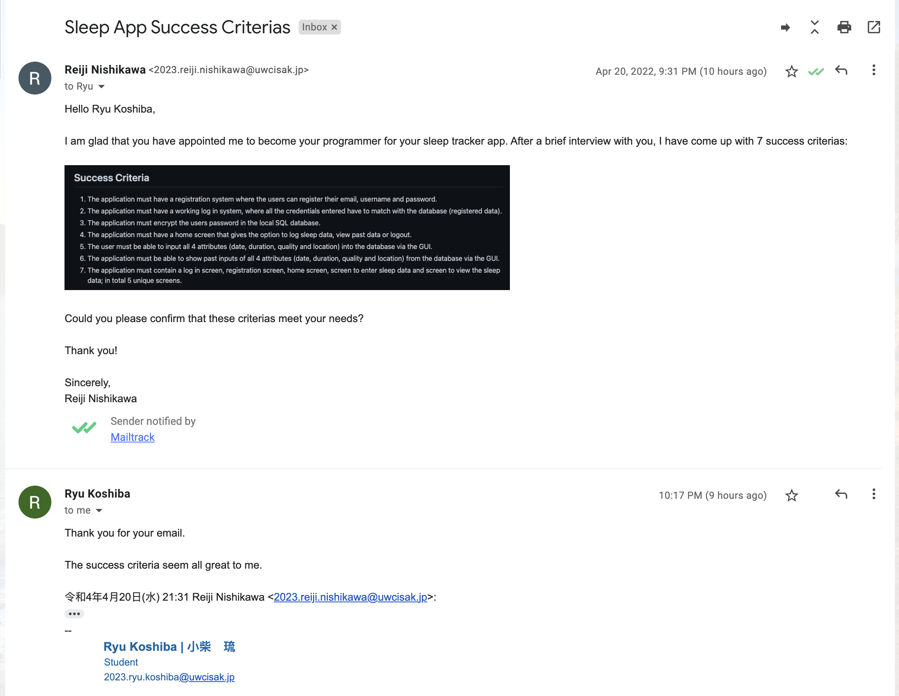
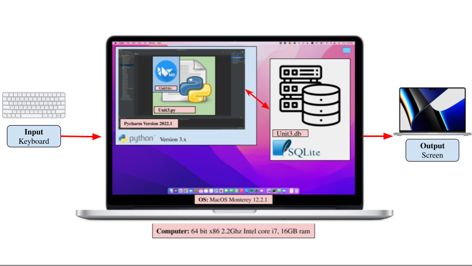
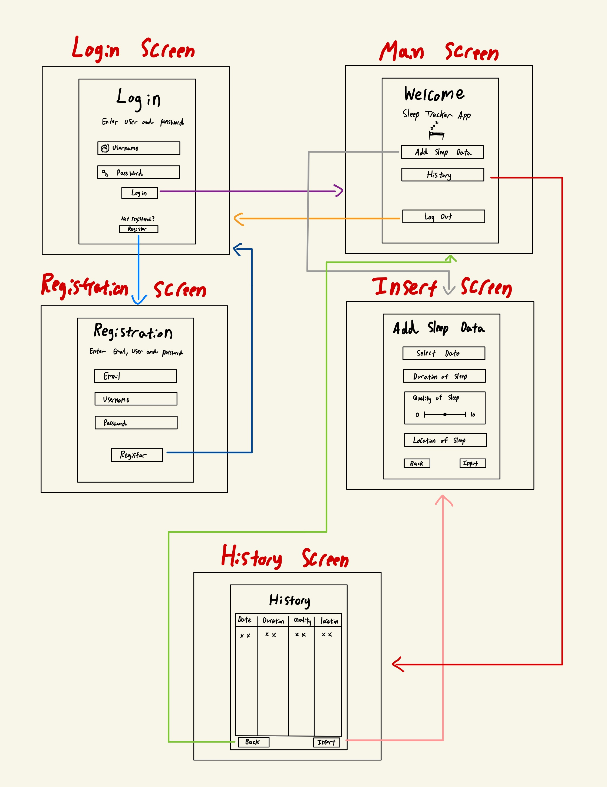
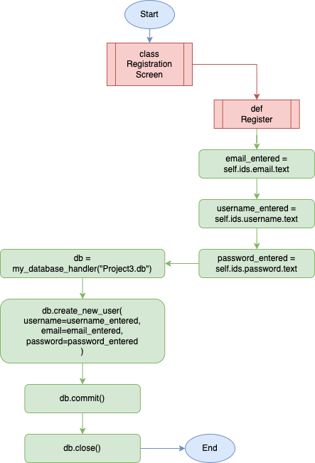
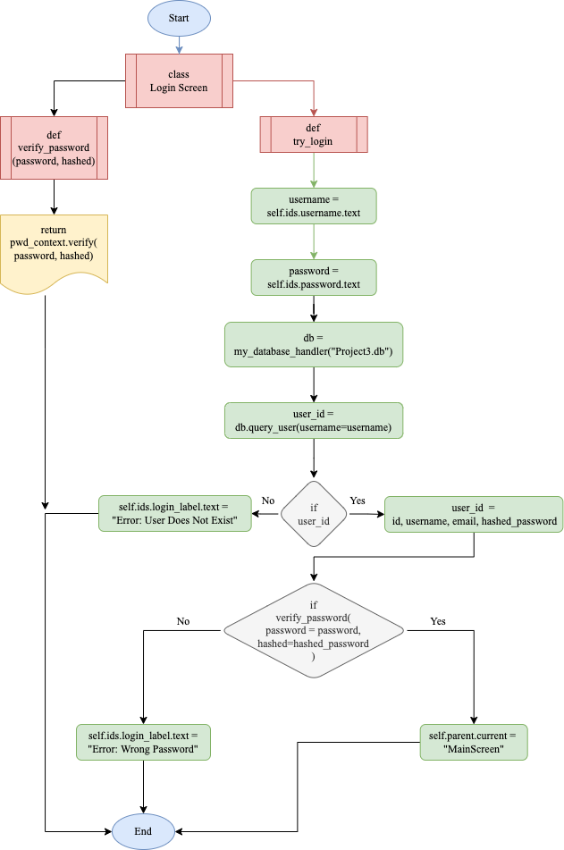
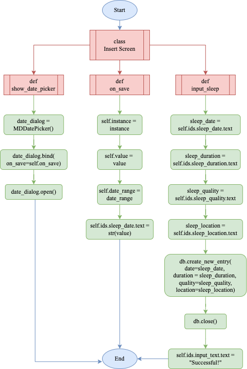
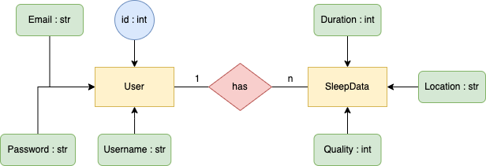
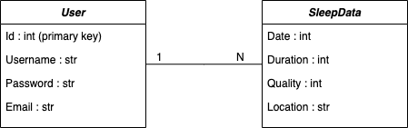

# Unit 3: Project Client

# Criteria A: Planning

## Problem definition
My Roommate, Ryu Koshiba has recently been sleep deprived and wants to understand his sleep pattern throughout the month to prepare himself for his final exams coming up. To do this, Ryu wants an app developer to create an app that tracks his duration of sleep, date of sleep, quality of sleep, and location of sleep to best understand his sleep pattern. He wants an app that has a GUI and has accessible buttons and text boxes so he can input data in a straightforward matter.

- The client is recently sleep deprived
- The client requires an app that can record and track his sleep duration, date, quality and location.
- The client requires an app that has a GUI

## Proposed Solution:

### Design Statement
I will design and make an app that tracks the date, duration, quality (out of 10), and location of sleep for my client who is my roommate, Ryu Koshiba. The application will be able to keep track of all sleep stats via the use of a login system. To ensure security and privacy, the login system will have a hashing system to secure everyones password and will all be saved in a local database using SQLite. The application will have a GUI so that users can easily guide themselves throughout the app with mouse clicks. This all will be created using the Python 3.x language with the help of KivyMD for GUI construction. All code will be created and developed on the application, Pycharm. This app will take 4 weeks to complete and will be evaluated according to the criteria. 

## Justification

### Why Python?
Out of every programming language, I have chosen to use Python 3.x for numerous reasons. For starters, Python is the most well known and used programming language throughout the world (1). This will not only allow me to have greater access to resources and references but also the app will also be compatible with a greater number of systems, improving the overall experience of the client. Personally I am the most comfortable with programming Python and so not only will everything be streamlined but also the client will receive the app in a timely manner, without any extensions of the due date. Judging by the benefits of both the programmer and client, its safe to say that Python is the right programming language to use for this project. 

### Why KivyMD?
KivyMD will be used to construct the graphical user interface (GUI) for the user to navigate throughout the app. I have chosen KivyMD because not only is KivyMD compatible throughout all 3 main operating systems, but also is one of the more simpler GUI libraries to learn (2). KivyMD’s goal, “to approximate Google's Material Design spec as close as possible without sacrificing ease of use or application performance.” (3) also greatly relates to the clients experience as the GUI is what the client actually sees and a good GUI is always appreciated in every application. KivyMD is also the library I am the most familiar with and will help me as a developer to finish my project on time. Through these reasons, I have come to the conclusion that KivyMD is the most appropriate GUI node for my project. 

### Why SQLite?
SQLite is a database engine written in the C language(4) but also comes bundled with Python and can be used in any Python applications without having to install any additional software (5). I am also most familiar with this database structure and console which will allow me to create the database quickly and will match the client's deadline more effectively. With this flexibility and ease of use, I have decided to use SQLite for this project's database. 

### Why is the output a GUI?
The application will have an output of a GUI rather than text. This is to meet the requirement of the client where he requires an application that can not only record and show his sleep data, but do all that through a GUI for ease of use. Due to the clients requirements, I have decided that the output should be through a GUI. 

## Success Criteria

1. The application must have a registration system where the users can register their email, username and password.
2. The application must have a working log in system, where all the credentials entered have to match with the database (registered data).
3. The application must encrypt the users password in the local SQL database.
4. The application must have a home screen that gives the option to log sleep data, view past data or logout. 
5. The user must be able to input all 4 attributes (date, duration, quality and location) into the database via the GUI.
6. The application must be able to show past inputs of all 4 attributes (date, duration, quality and location) from the database via the GUI.
7. The application must contain a log in screen, registration screen, home screen, screen to enter sleep data and screen to view the sleep data; in total 5 unique screens. 

### Client Approval

## Works Cited

1. "The 10 Most Popular Programming Languages to Learn in 2021." Northeastern University Graduate Programs, 14 May 2021, www.northeastern.edu/graduate/blog/most-popular-programming-languages/. Accessed 28 Mar. 2022.

2. ResellerClub. "The 6 Best Python GUI Frameworks for Developers." Medium, 18 Oct. 2019, medium.com/teamresellerclub/the-6-best-python-gui-frameworks-for-developers-7a3f1a41ac73. Accessed 28 Mar. 2022.

3. "Kivymd/KivyMD: KivyMD is a Collection of Material Design Compliant Widgets for Use with Kivy, a Framework for Cross-platform, Touch-enabled Graphical Applications. Https://youtube.com/c/KivyMD Https://twitter.com/KivyMD Https://habr.com/ru/users/kivymd Https://stackoverflow.com/tags/kivymd." GitHub, github.com/kivymd/KivyMD. Accessed 28 Mar. 2022.

4. "SQLite Home Page." SQLite, www.sqlite.org/index.html. Accessed 28 Mar. 2022.

5. "How To Use the Sqlite3 Module in Python 3." DigitalOcean – The Developer Cloud, 2 June 2020, www.digitalocean.com/community/tutorials/how-to-use-the-sqlite3-module-in-python-3. Accessed 28 Mar. 2022.

-----------------------------------------------------------------------------------------------------------------------------------------------------------

# Criteria B: Design

## System Diagram

### Fig1. System Diagram of the application

The system diagram shows how the application interacts with each other. The input will be done with a keyboard (input of numbers) and the output will be shown on the screen. The application will be on a computer, which will be inside the MacOS operating system. The app will then be operated via Python version 3.x and executed on Pycharm via the file name, Unit3.py and Unit3.kv. These python files are then connected with a SQL database called Unit3.db. 

## Wireframe Diagram

### Fig2. Wireframe Diagram of the GUI

This Wireframe Diagram shows the generate outline of the GUI of the application. It shows the functionalities of every button planned out to be used in the application and shows all 5 screens of the application. 

## Flow Diagrams

### Fig3. Registration Screen Flow Diagram

This is the flowchart of when the user registers their Email, Username, and Password. 

### Fig4. Login Screen Flow Diagram

This is a flowchart showing how the login screen functions. It shows how the log in screen matches all the text inputs with the creditentials in the database.

### Fig5. Data insert Screen Flow Diagram

This is a flowchart showing how inputting data into the GUI connects and communicated with the database.

## ER Diagram

### Fig6. Data insert Screen Flow Diagram

## UML Diagram

### Fig7. UML Diagram for Application Database

## Table of data

### Table of User Database

| Id | Username | Password                                                                               | EMail                     |
|----|----------|----------------------------------------------------------------------------------------|---------------------------|
| 1  | Raijee   | password123 | reiji.nishikawa@gmail.com |

Caption

### Table of Sleep Database

| Date       | Duration | Quality | Location |
|------------|----------|---------|----------|
| 2022-04-17 | 9        | 8       | Bed      |

Caption

# Test Plan

## Record of Tasks
| Task NO | Planned Action                                                      | Planned Outcome                                                     | Time estimate | Target completion date | Criterion |
|---------|---------------------------------------------------------------------|---------------------------------------------------------------------|---------------|------------------------|-----------|
| 1       | Interview client (Koshiba Ryu) and record                           | A record of the interview (email)            | 30 minutes    | March 20th             | A         |
| 2       | Writing the Problem Definition in the repository                    | A clear problem definition in Github                                | 20 minutes    | March 20th             | A         |
| 3       | Writing the design statement in the repository                      | A clear design statement that suits the need of the client          | 20 minutes    | March 20th             | A         |
| 4       | Writing all the justification for programs and methods used         | A clear justification that suits the client and myself              | 30 minutes    | March 20th             | A         |
| 5       | Writing all 6 success criterias                                     | A clear success criteria that suits the client                      | 20 minutes    | March 20th             | A         |
| 6       | Cite all work used in Criteria A                                    | MLA format citing at the bottom of Criteria A                       | 10 minutes    | March 20th             | A         |
| 7       | Create system diagram of application                                | A clear and creative system diagram of the app                      | 20 minutes    | March 25th             | B         |
| 8       | Explain the system diagram                                          | A brief explanation about the system diagram                        | 10 minutes    | March 25th             | B         |
| 9       | Draw wireframe diagram of GUI                                       | A clear and creative wireframe diagram of the GUI                   | 20 minutes    | March 25th             | B         |
| 10      | Explain the wireframe diagram                                       | A brief explanation about the wireframe                             | 10 minutes    | March 25th             | B         |
| 11      | Code and create a working log in screen of the app                  | A working log in screen with python or kivyMD with a GUI            | 3 hours       | March 30th             | C         |
| 12      | Code and create a working registration screen of the app            | A working registration screen with python or kivyMD with a GUI      | 2 hours       | April 3rd              | C         |
| 13      | Draw 3 flow diagrams of 3 functions or classes from the application | A clear diagram of all 3 flow diagrams                              | 30 minutes    | April 5th              | B         |
| 14      | Explain all flow diagrams                                           | A brief explanation about all 3 flow diagrams                       | 20 minutes    | April 5th              | B         |
| 15      | Code and create a working menu screen of the app                    | A working menu screen with python or kivyMD with a GUI              | 2 hours       | April 10th             | C         |
| 16      | Ensure all databases are correct and connected with the application | A working and connected SQL database                                | 1 hour        | April 12th             | C         |
| 17      | Draw an ER diagram of the application                               | A clear ER diagram of the application                               | 10 minutes    | April 12               | B         |
| 18      | Explain the ER diagram                                              | A brief explanation about the ER diagram                            | 10 minutes    | April 12th             | B         |
| 19      | Draw the table of data of both databases                            | A table of the data represented in both databases                   | 10 minutes    | April 12th             | B         |
| 20      | Explain both table of datas                                         | A brief explanation about both table of datas                       | 10 minutes    | April 12th             | B         |
| 21      | Creating a test plan                                                | A clear test plan to ensure the functionality of the application    | 1 hour        | April 12th             | B         |
| 22      | Create sleep data insert page                                       | A working insert screen with python and kivyMD with a GUI           | 2 hours       | April 15th             | C         |
| 23      | Create sleep data history page                                      | A working history screen with python and kivyMD with a GUI          | 2 hours       | April 15th             | C         |
| 24      | Linking the table on the history page with the database             | A working table that show all data from the database as a GUI       | 1 hour        | April 15th             | C         |
| 25      | Testing all test plans                                              | All test plans successful and functional, debug if necessary        | 3 hours       | April 18th             | C         |
| 26      | Record video of all success criterias                               | Video evidence of all the success criterias functioning and working | 2 hours       | April 20th             | D         |

# Criteria C:

How to update software
